# Can experience replay prevent training divergence in Double DQN?
# Research

## Experimental Setup

### World
- 8×8 Grid-World environment    
- 80% of the cells are empty
- 10% contain a positive reward (+5)    
- 10% contain a negative reward (-5)
- Reward cells do not disappear after interaction.
- The map layout is randomly generated for each run and controlled by fixed seeds.
### Agent
- MLP
    - 2 hidden layers
    - 64 neurons per layer
- 8 available actions
- Target Network
- Double DQN
- Curiosity-driven exploration
- ε-greedy exploration
- Curiosity decay
- ε decay

Learning parameters:
```text
learning_rate = 0.001

epsilon = 0.1
epsilon_decay = 0.995
epsilon_min = 0.001
```
Replay Buffer configuration:
```text
buffer_size = 10000
batch_size = 32
min_buffer_size = 500
```
---
## Limitations
This study has several important limitations.
- Only a single environment was evaluated.
- Only one MLP architecture was tested.

Therefore, the conclusions should be interpreted only within the scope of this experimental setup.

---
## The Problem

Training Double DQN without experience replay consistently resulted in training divergence. During learning, the loss and estimated Q-values continuously increased, eventually reaching extremely large values. As training progressed, value estimates became increasingly unstable and prevented the agent from learning an effective policy.

---
## Research Question

**Can experience replay prevent training divergence in Double DQN?**

---
## Hypothesis

Experience replay will reduce value divergence by decorrelating training samples, resulting in lower loss values, more stable Q-value estimates, and improved learning performance.

---
## Metrics
1. loss
2. mean Q
3. max Q
4. target Q
5. Q prediction
6. episode reward
7. environment reward
8. intrinsic reward
9. Q range
    + max_q - min_q

---
## Experiments

Each experiment started from a newly initialized MLP with randomly initialized weights.
Three independent pairs of experiments were conducted.
For every seed, two agents were trained:
- without replay buffer
- with replay buffer

The same seed was used in both configurations to ensure a fair comparison.

---

## Result 1
Seed: 1783774199194415
###### Without replay buffer
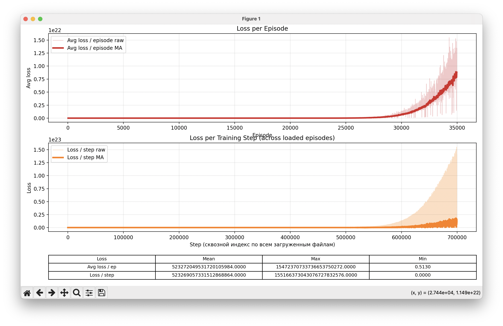


###### With replay buffer
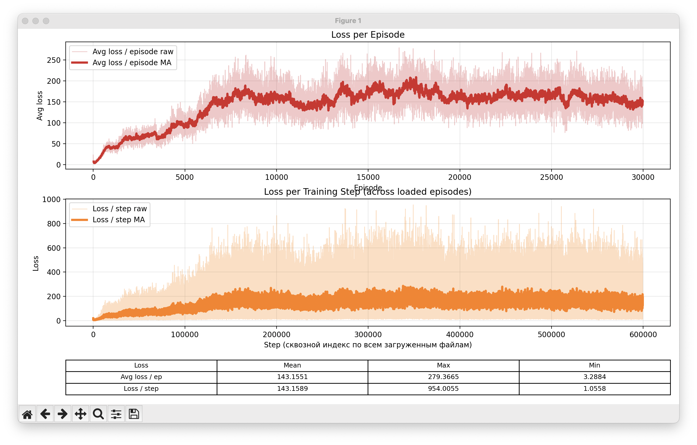
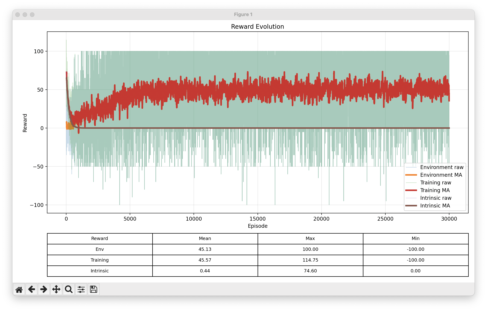
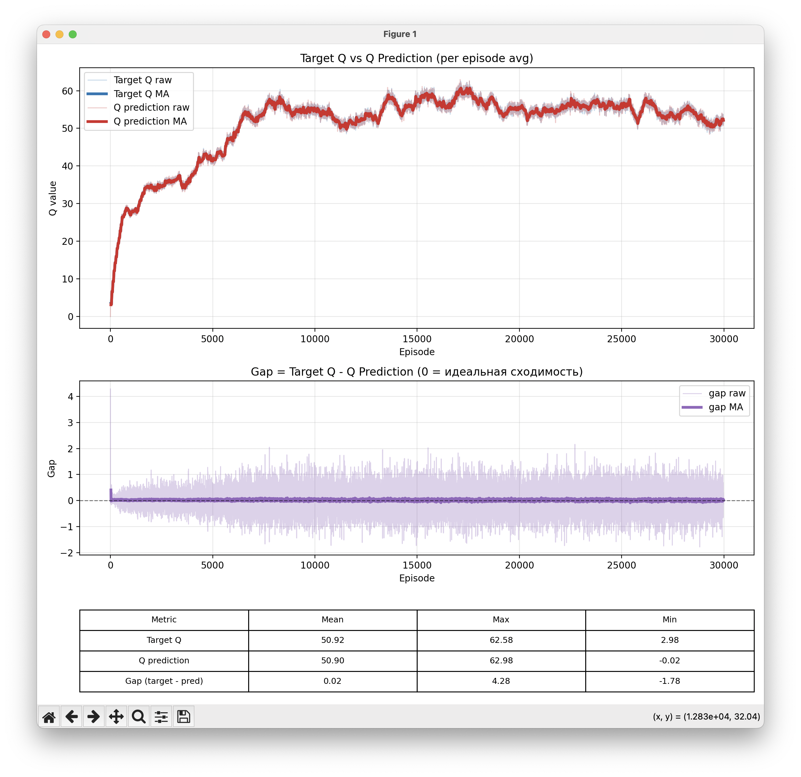

##### Discussion
After introducing the replay buffer:
- Loss decreased from **5.23272049531720e+20** to **143**.
- Average reward increased from **2.42** to **45.57**.

In this experiment, experience replay effectively prevented training divergence. The loss remained bounded throughout training, and the agent achieved substantially higher rewards.

---

## Result 2

Seed: 1783774741005238
###### Without replay buffer
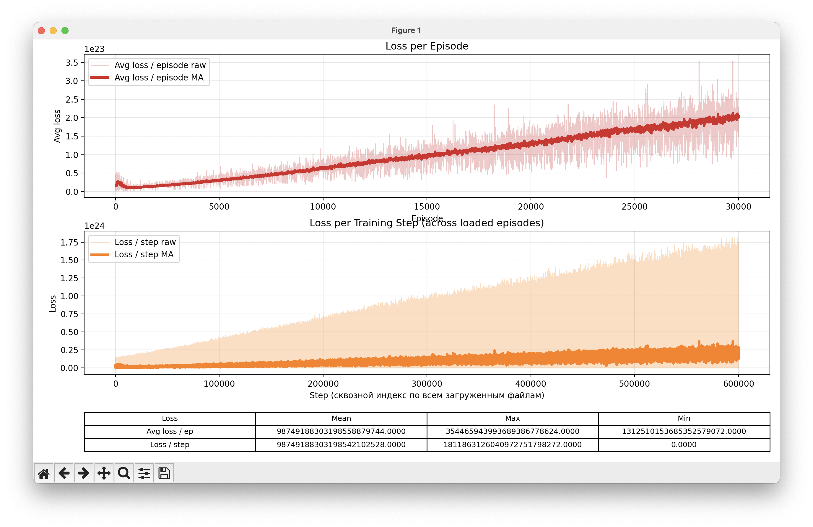
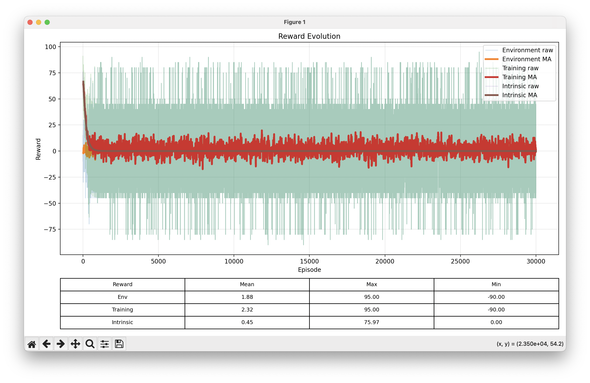
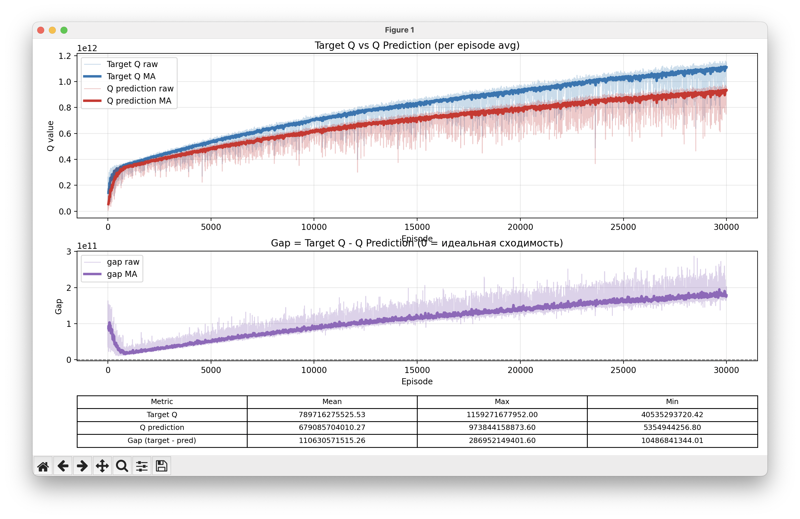

###### With replay buffer


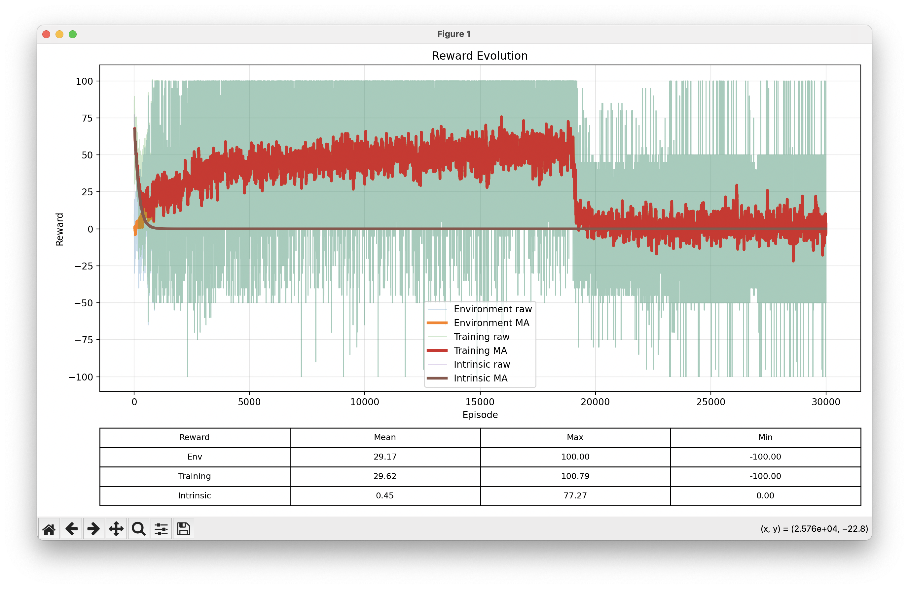

##### Discussion
After introducing the replay buffer:
- Loss decreased from **9.874919e+22** to **1.127795e+16**.
- Average reward increased from **2.32** to **29**.

However, an unexpected anomaly appeared during training.
Shortly before **20,000 episodes**, the average reward suddenly collapsed and never recovered.
Later, close to **30,000 episodes**, both the loss and value estimates increased rapidly after a relatively stable training period.

### Observation
The exact cause of this behavior is currently unknown.
However, several observations can be made.

First, the degradation occurred very rapidly. Training remained stable for a long period before deteriorating within approximately one thousand episodes.

Second, the following sequence was consistently observed:

Reward decreases =>
Approximately 10,000 episodes later => 
Loss increases => 
Target Q increases => 
Q prediction increases =>

An additional observation is that the replay buffer size is **10,000** transitions.
Although this temporal coincidence is interesting, no causal relationship can currently be established.
At this stage, these observations are reported without attempting to explain the underlying mechanism.

---
## Result 3

Seed: 1783775096764675
###### Without replay buffer


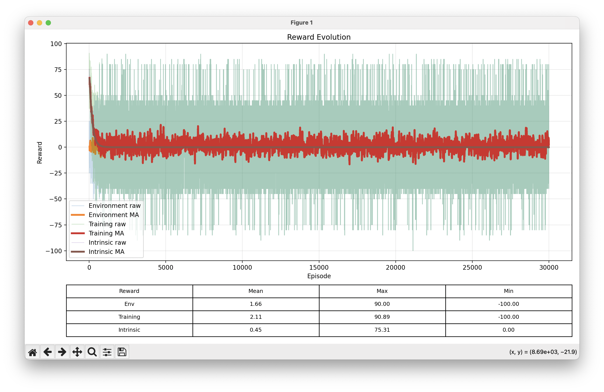

###### With replay buffer

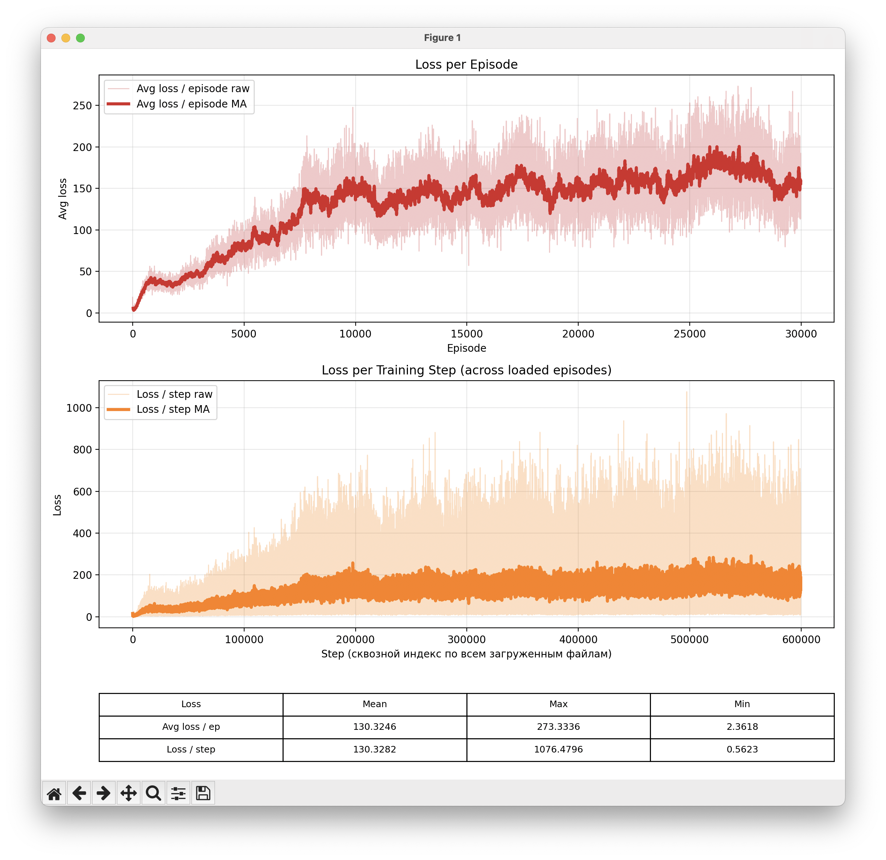
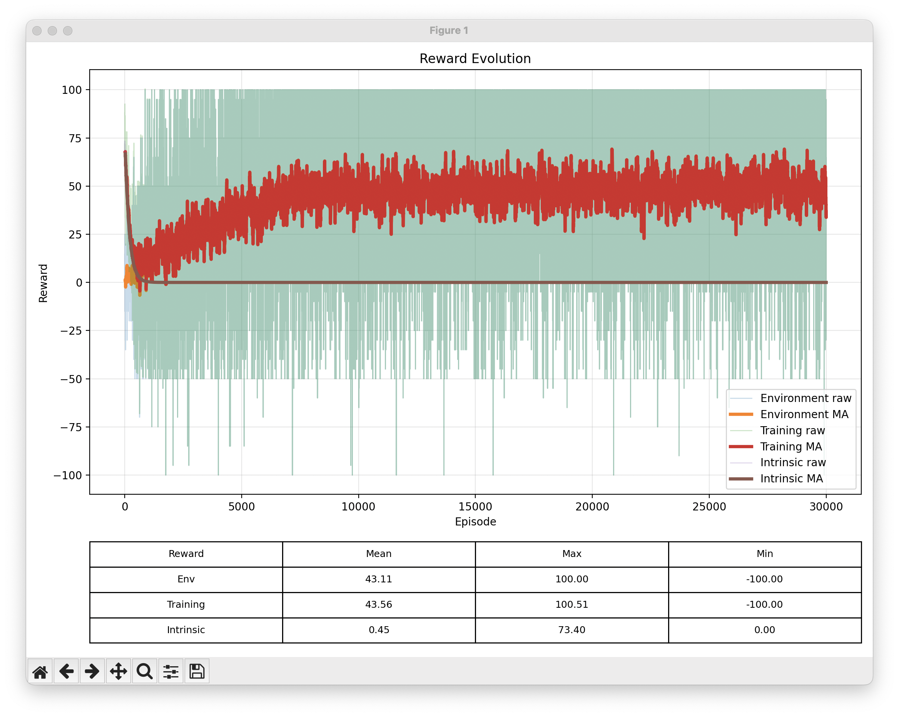


##### Discussion

After introducing the replay buffer:

- Loss decreased from **2.726618e+23** to **130**.
- Average reward increased from **2.11** to **43**.

In this experiment, experience replay successfully prevented training divergence and produced substantially better learning performance.

---

# Conclusion

Across three independent experiments, introducing experience replay dramatically reduced training divergence.

The average loss decreased by approximately:


- **18 orders of magnitude** in Experiment 1.
- **7 orders of magnitude** in Experiment 2.
- **21 orders of magnitude** in Experiment 3.
    

In two out of three experiments, experience replay successfully prevented divergence and simultaneously produced significantly higher rewards.

However, one experiment still exhibited a severe training anomaly. During this run, the average reward suddenly collapsed and never recovered. This was followed by a rapid increase in both the loss and estimated Q-values, indicating that divergence was delayed but not completely prevented.

Overall, these results suggest that experience replay is highly effective at reducing training divergence in Double DQN under the tested conditions. Nevertheless, it does not completely eliminate the possibility of divergence, indicating that additional stabilization techniques may still be required.

Finally, an unexpected anomaly was observed in **Experiment 2**. Although its underlying cause remains unknown, the recorded observations may serve as the basis for future investigation.