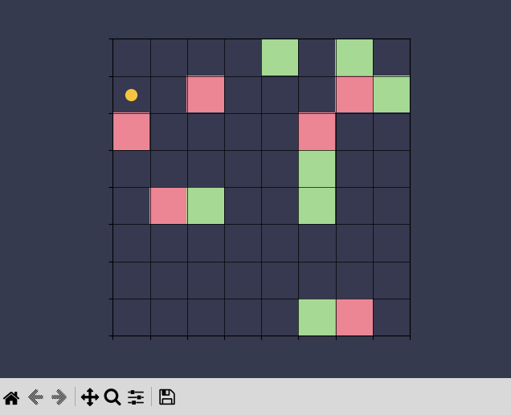

### Stage 1 — Foundation 

**The goal of this stage** is to build a solid base where I can later plug in a real AI and be confident that the environment, rewards, and overall world are working correctly and actually push the agent to learn.
(If I start with a real AI right away, I won’t be able to tell whether problems come from the AI itself or from a poorly designed environment.)

At this stage, the focus is not “intelligence” itself, but the conditions required for intelligence to emerge later:

* stable interaction between systems
* meaningful rewards
* reproducible experiments
* scalable architecture
* clean separation between modules

The entire stage acts as a testing ground for future learning systems.

---

##### Building a simple world (grid-world)

* there is a space where the agent operates
* there are objects and interactions (for now: reward, danger, and empty cells)
* there is a reward and penalty system
* there is logging to understand what’s going on
* the map is generated
* most cells are intentionally empty to reduce noise during training
* all object types are guaranteed to spawn

The environment is intentionally minimal.
The goal is to make learning behavior easy to observe and debug before introducing more complex systems.

---

##### Building the agent

* it has a body
* it can move
* it has observations
* it has a state
* it interacts with the world through actions
* it does not directly control learning

The agent is separated from the “brain” architecture.
Its responsibility is interaction and state management, not decision making itself.

---

##### Brain

* Q-table
* policy
    + argmax
    + ε greedy
    + ε decay 
+ reward shaping
    * Curiosity-driven rewards
        + curiosity decay 

The current brain is intentionally simple and acts as a temporary learning core.

The Q-table is **not the final intelligence system** and will later be replaced by a neural network.
Right now it exists because it is:

* easy to debug
* interpretable
* deterministic
* useful for validating reward dynamics and environment structure

This allows me to verify:

* can the agent learn at all
* are the rewards working correctly
* does meaningful behavior emerge
* does exploration actually happen

If learning doesn’t happen at this stage, the problem is not the “brain” — it’s the environment.

---

##### Success conditions

Stage 1 is considered successful if:

* average reward increases over time
* the agent consistently interacts with positive rewards
* exploration behavior emerges
* learning is reproducible through seeds
* the architecture remains modular and replaceable
* the system behaves consistently across many episodes

The goal is not perfect intelligence.

The goal is proving that:

* the world produces meaningful learning pressure
* the architecture supports learning
* behavior emerges from interaction instead of hardcoded logic

---

##### Experimentation Infrastructure

Stage 1 also establishes:

* logging
* visualization
* testing
* configuration handling
* deterministic experiment pipelines
* seed-based reproducibility

These systems are necessary before introducing more complex learning architectures.

---

### Connection to the next stage

Once the system starts learning consistently:

* we **don’t touch the world**
* we don’t change the rewards
* we don’t change the mechanics
* we don’t change the policy

We simply replace the Q-table with a neural network.

The purpose of Stage 1 is to make sure that when this replacement happens, any improvements or failures come from the new “brain” itself — not from hidden problems inside the environment.
